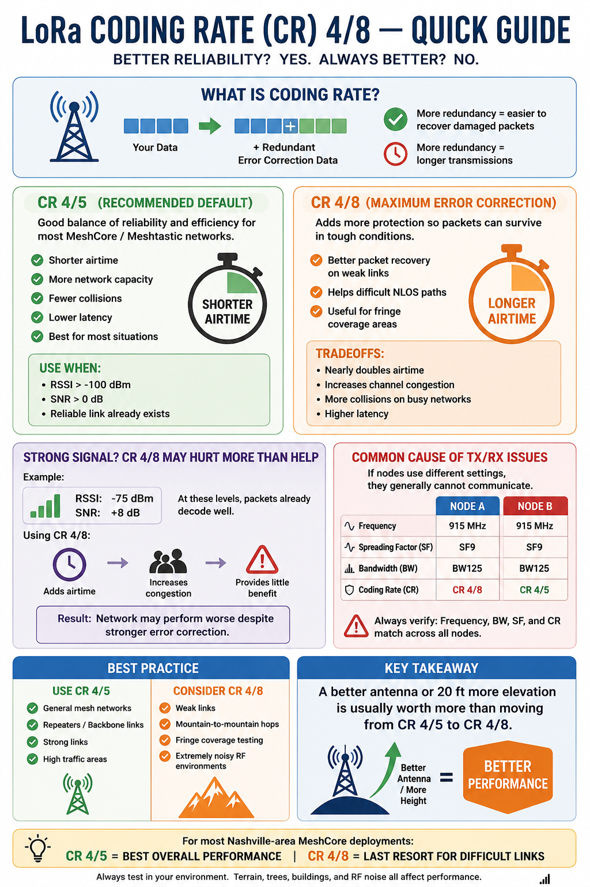

<h1 class="page-title-with-logo">MeshCore</h1>

Below are the recommended radio settings for the Nashville area, aligned with the settings recommended by [TennMesh](https://tennmesh.com).

## Flashing Your Device

NashMesh recommends running the **latest firmware** on your nodes. You can flash your device using the [MeshCore Web Flasher](https://flasher.meshcore.io).

Running a Room Server/Repeater or Repeater node? You can update it wirelessly using [Over-the-Air OTA flashing](#flashing-over-the-air-ota).

## Radio Settings

<h3>Companion</h3>
<table>
<thead><tr><th>Setting</th><th>Value</th></tr></thead>
<tbody>
<tr><td>Preset</td><td><code>USA/Canada</code></td></tr>
<tr><td>Frequency</td><td><code>910.525 MHz</code></td></tr>
<tr><td>Bandwidth</td><td><code>62.5 kHz</code></td></tr>
<tr><td>Spread Factor</td><td><code>7</code></td></tr>
<tr><td>Coding Rate</td><td><code>5</code></td></tr>
</tbody>
</table>

<h3>Repeater</h3>
<table>
<thead><tr><th>Setting</th><th>Value</th></tr></thead>
<tbody>
<tr><td>Preset</td><td><code>USA/Canada</code></td></tr>
<tr><td>Frequency</td><td><code>910.525 MHz</code></td></tr>
<tr><td>Bandwidth</td><td><code>62.5 kHz</code></td></tr>
<tr><td>Spread Factor</td><td><code>7</code></td></tr>
<tr><td>Coding Rate</td><td><code>5</code></td></tr>
</tbody>
</table>

Not sure why we use coding rate 5? <a href="#coding-rate">Learn more ↓</a>

## Repeater Details

### Repeater Advert Intervals

The following advert intervals are recommended for repeaters operating in the Middle TN area.

| Type     | Interval   |
| -------- | ---------- |
| Zero Hop | 60 minutes |
| Flood    | 3 hours    |

### Path Hash Size

NashMesh uses a **2-byte hash mode** for path hashing, available on radios running firmware 1.14+. Using 2 bytes helps prevent collisions during routing, improving reliability across the network.
NashMesh uses a **2-byte hash mode** for path hashing, available on radios running firmware 1.14+. Using 2 bytes helps prevent collisions during routing, improving reliability across the network.

**Companion nodes:** From the home screen: Gear icon → Experimental Settings → Default Path Hash Size → `2-Byte`

**Repeaters:** Use the following command via the MeshCore app CLI or [meshcore-cli](https://github.com/meshcore-dev/meshcore-cli):

<pre><code>set path.hash.mode 1</code></pre>

### Repeater Commands

#### Common Settings

These settings are recommended for all repeaters. Commands can be entered via the command line in the MeshCore app, or by using [meshcore-cli](https://github.com/meshcore-dev/meshcore-cli).

<pre><code>set agc.reset.interval 4</code></pre>

<pre><code>set multi.acks 1</code></pre>

<pre><code>set rxdelay 3</code></pre>

#### Neighbor-Based Delay Tuning

Apply the settings that match the number of neighbors your node currently sees. As your node sees more neighbors over time, revisit and update these settings accordingly.

#### Neighbor Count: 0–1

Use these settings if your node sees **0 to 1** neighbors.

<pre><code>set txdelay 0.3</code></pre>

<pre><code>set direct.txdelay 0.1</code></pre>

<pre><code>set agc.reset.interval 4</code></pre>

<pre><code>set multi.acks 1</code></pre>

<pre><code>set rxdelay 3</code></pre>

#### Neighbor Count: 2–4

Use these settings if your node sees **2 to 4** neighbors.

<pre><code>set txdelay 0.5</code></pre>

<pre><code>set direct.txdelay 0.3</code></pre>

<pre><code>set agc.reset.interval 4</code></pre>

<pre><code>set multi.acks 1</code></pre>

<pre><code>set rxdelay 3</code></pre>

#### Neighbor Count: 5–9

Use these settings if your node sees **5 to 9** neighbors.

<pre><code>set txdelay 1</code></pre>

<pre><code>set direct.txdelay 0.5</code></pre>

<pre><code>set agc.reset.interval 4</code></pre>

<pre><code>set multi.acks 1</code></pre>

<pre><code>set rxdelay 3</code></pre>

#### Neighbor Count: 10–14

Use these settings if your node sees **10 to 14** neighbors.

<pre><code>set txdelay 1.5</code></pre>

<pre><code>set direct.txdelay 1</code></pre>

<pre><code>set agc.reset.interval 4</code></pre>

<pre><code>set multi.acks 1</code></pre>

<pre><code>set rxdelay 3</code></pre>

#### Neighbor Count: 15+

Use these settings if your node sees **15 or more** neighbors.

<pre><code>set txdelay 2</code></pre>

<pre><code>set direct.txdelay 2</code></pre>

<pre><code>set agc.reset.interval 4</code></pre>

<pre><code>set multi.acks 1</code></pre>

<pre><code>set rxdelay 3</code></pre>

<h2 id="coding-rate">Coding Rate</h2>

{ .img-thumbnail }

## Flashing Over the Air (OTA)

OTA flashing lets you update your MeshCore device wirelessly without a USB cable, using a Wi-Fi access point created by the device itself.

!!! info "Supported node types"
    OTA updates are only supported on **Room Server/Repeater** and **Repeater** nodes.

!!! warning "nRF52 devices — Bluetooth OTA only"
    If your device uses an **nRF52** chip, it does not support Wi-Fi OTA. Updates must be performed over **Bluetooth** using a dedicated app:

    - **iOS:** [nRF Device Firmware Update](https://apps.apple.com/us/app/nrf-device-firmware-update/id1624454660)
    - **Android:** [nRF Connect](https://github.com/nordicsemi/Android-nRF-Connect)

    Download the firmware `.zip` (not `.bin`) from the [MeshCore Web Flasher](https://flasher.meshcore.io) and follow the in-app instructions to perform the update.

!!! warning "Choose the right `.bin` file"
    Always download the **un-merged** `.bin` from the [MeshCore Web Flasher](https://flasher.meshcore.io) for OTA updates — this updates only the firmware and preserves your settings. Only use the **merged** `.bin` if you intend to fully erase the device and start fresh.

#### Step 1 — Start OTA mode

Open your MeshCore companion app and log into the node. From the Command Line, run:

<pre><code>start ota</code></pre>

Your device will create a Wi-Fi access point named **MeshCore-OTA**.

#### Step 2 — Connect and upload

On your computer, connect to the **MeshCore-OTA** Wi-Fi network. Then open a browser and navigate to:

<pre><code>http://192.168.4.1/update</code></pre>

Upload the `.bin` file you downloaded in Step 1. Wait for the upload to fully complete before closing the browser or navigating away.

#### Step 3 — Confirm the update

Once the upload is done, reopen your companion app and log back into the device. From the Command Line, run:

<pre><code>version</code></pre>

Confirm the firmware version shown matches what you flashed.

