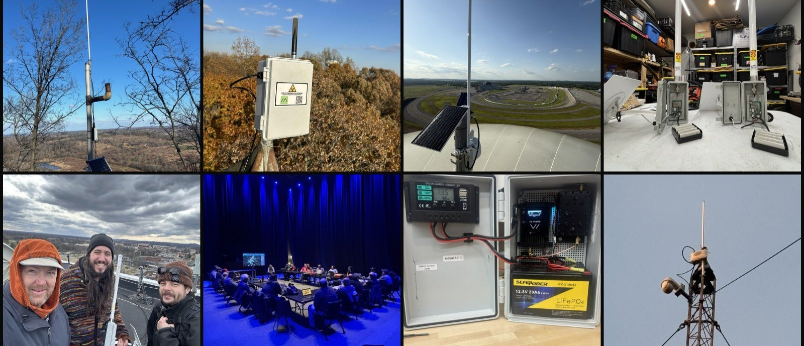

## Mission
Our mission is to provide a reliable mesh network along with resources, guidance, and support for anyone who would like to use the network.

## What Is Meshtastic?
Meshtastic is an community-based, open-source project that provides for a decentralized, off-grid mesh network built on low-powered devices. It's used
as a messaging platform that provides a backup for everyday communication. Many of us like to use it during disasters, power outages, or to enjoy as a hobby.
To learn about Meshtastic, check out their [offical homepage](https://meshtastic.org).

### How Do I Get Involved?
Feel free to jump into our [Discord](https://discord.gg/sSS8gEpuh8)! We have plenty of folks with experience and knowledge that can help you get started.

### How Do I Get Started?
If you're looking to build or buy a pre-built node, check out our [affiliate](affiliate.md) page where you can browse different pre-builds or componenets. Buying with one of our affiliate links also helps to support the network!

Have a node but not sure how to set it up? Check out our [getting started](getting-started.md) page.

### Who's Around Me?
A top-level view of this map provides a heat signature for any active nodes in the area. Zoom in to show where nodes are available.

## Resources
<button style="width: 25%; height: 25%"><a href="https://discord.gg/sSS8gEpuh8">Discord</a></button>
<button style="width: 25%; height: 25%"><a href="https://malla.nashme.sh">Malla</a></button>
<button style="width: 25%; height: 25%"><a href="https://potato.nashme.sh">Potato Map</a></button>

# Customize
<button class="color-button" data-theme="light">
    <code style="background: #ffffff !important; color: #000000 !important">light</code>
</button>
<button class="color-button" data-theme="dark">
    <code style="background: #000000; color: #ffffff !important">dark</code>
</button>