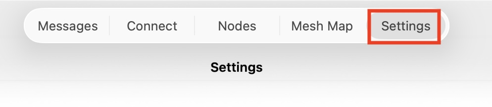
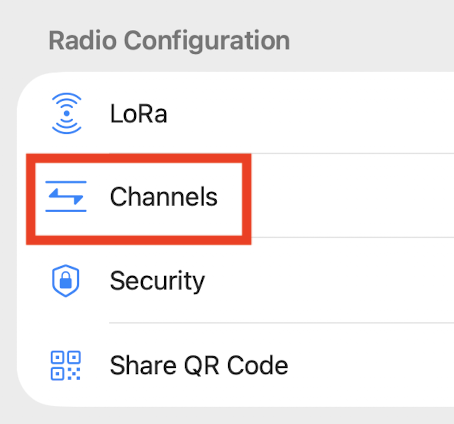
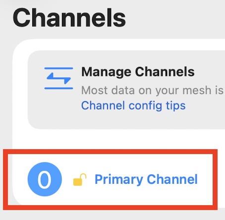
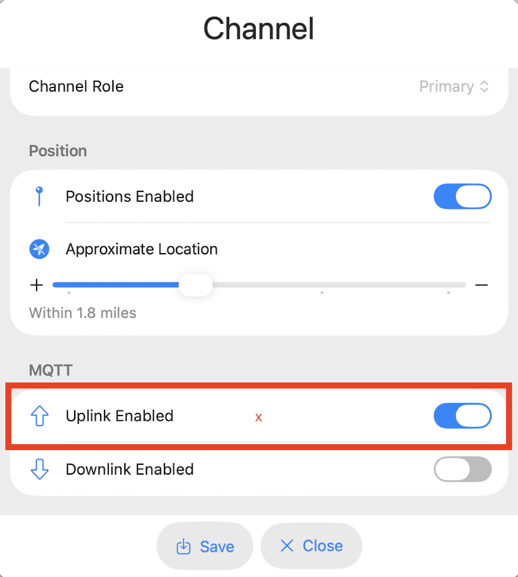
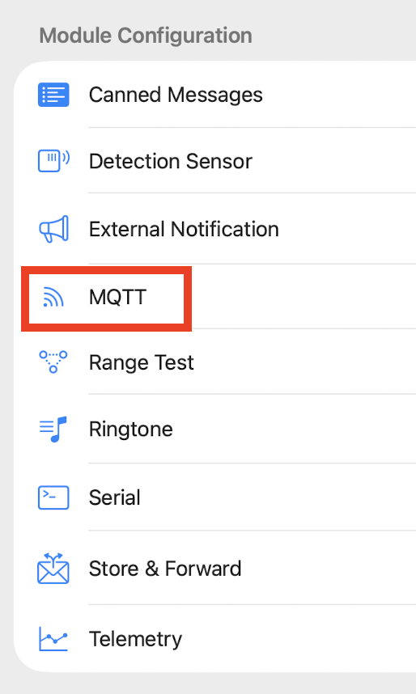
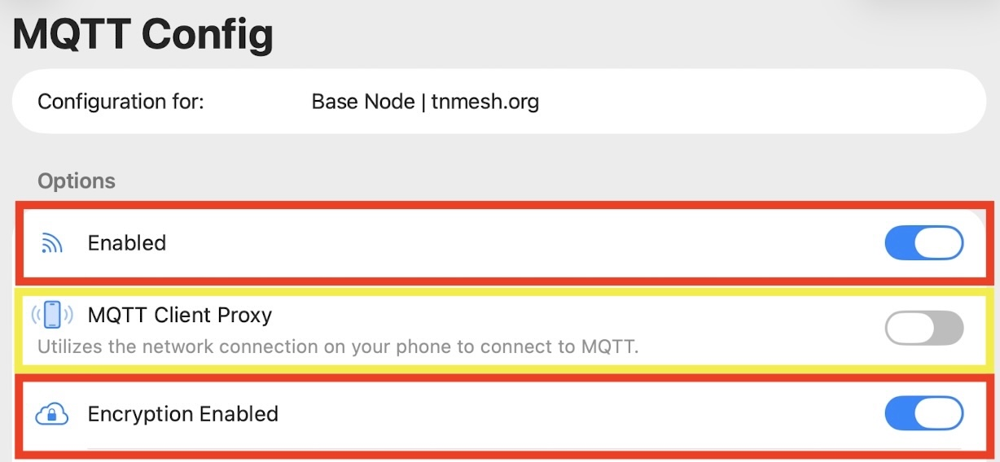
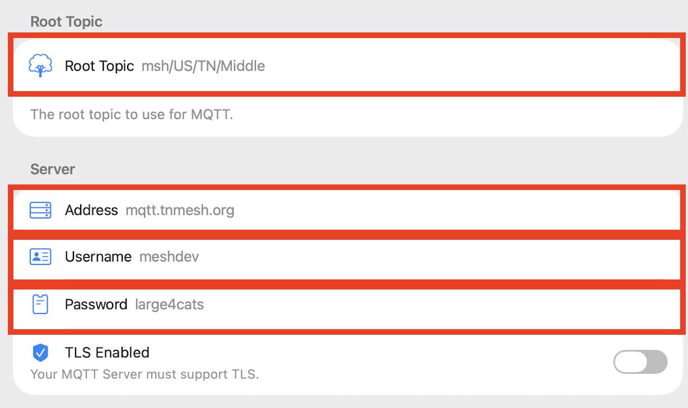

## What is MQTT?

MQTT is a message-broker application that mesh nodes can connect to. By connecting to an MQTT server, all LoRa traffic your node sees is sent over to our MQTT server where applications can pull and use.

=== "Meshtastic"

    If you would like to still help with contributing your nodes data but do not want to connect to MQTT, please set `OK to MQTT` to `true`.

    This allows any MQTT gateway (a node connected to MQTT) to submit your data to our MQTT server. For more information on enabling `OK to MQTT`, check out [Meshtastic's website](https://meshtastic.org/docs/configuration/radio/lora/#ok-to-mqtt).

    ## Meshtastic MQTT Settings
    | Key              |  Value       |
    | ------------ | ---------------- |
    | Host       | `mqtt.nashme.sh`  |
    | Username   | `meshdev`          |
    | Password   | `large4cats`       |
    | Topic      | `msh/US/TN/Middle` |
    | Primary Channel Uplink   | `true`       |
    | Primary Channel Downlink   | `false`       |
    | Ok to MQTT  | `true`       |

    !!! note "Reminder"

        It's preferred that MQTT is used only for collecting and displaying data from nodes. To keep the system running smoothly for everyone, we kindly ask that you leave MQTT downlink turned off on all public channels. This helps reduce unnecessary traffic on the server.

    ### Setup Images

    Provided are images showing each required change that is needed to setup MQTT.

    === "Mac OS X and iOS"
        First navigate to the `Settings` tab. For `iOS`, this option is on the bottom of the screen.

        

        Then access the `Channels` option.

        

        Click on the `Primary Channel` to configure settings for it.

        

        Enable `Uplink Enabled` to allow MQTT to upload data the radio receives.

        

        Navigate to the `Settings` tab again. For `iOS`, this option is on the bottom of the screen.

        

        Click the `MQTT` module to configure settings for it.

        

        Set `Enabled` for MQTT and enable `Encryption Enabled`. If your radio depends on your phones cellular network for internet connectivity, enable `MQTT Client Proxy`.

        

        Set the `Root Topic` and MQTT server details.

        

=== "MeshCore"

    ## MeshCore MQTT Settings
    | Key              |  Value       |
    | ------------ | ---------------- |
    | Host       | `mqtt.nashme.sh`  |
    | Username   | `meshdev`          |
    | Password   | `large4cats`       |

    ### MeshCore Analyzer Observer

    An Observer is a MeshCore node that reports packets it hears to the [MeshCore Analyzer](https://analyzer.nashme.sh), helping map network coverage and reliability across the region. Observers can be repeaters, room servers, or companion devices, and can stop sharing data at any time.

    To set up your node as an observer, visit the [Observer Onboarding page](https://analyzer.letsmesh.net/observer/onboard?type=companion) for step-by-step instructions.

    ### Experimental Observer Firmware

    Experimental firmwares are available that include observer functionality built directly into the firmware — no companion device or separate install needed. Supported devices include Heltec T190/v3/v4, LilyGo T3S3 SX1262, RAK 3112, Station G2, T-Beam S3 Supreme, T-Beam SX1262/SX1276, and Xiao S3 WIO. Both repeater and room server variants are available.

    [Download experimental firmwares](https://files.gessaman.com/meshcore-observer/1.14.1-experimental-mqtt-observer-firmwares/){ .fundraiser-donate-btn }
