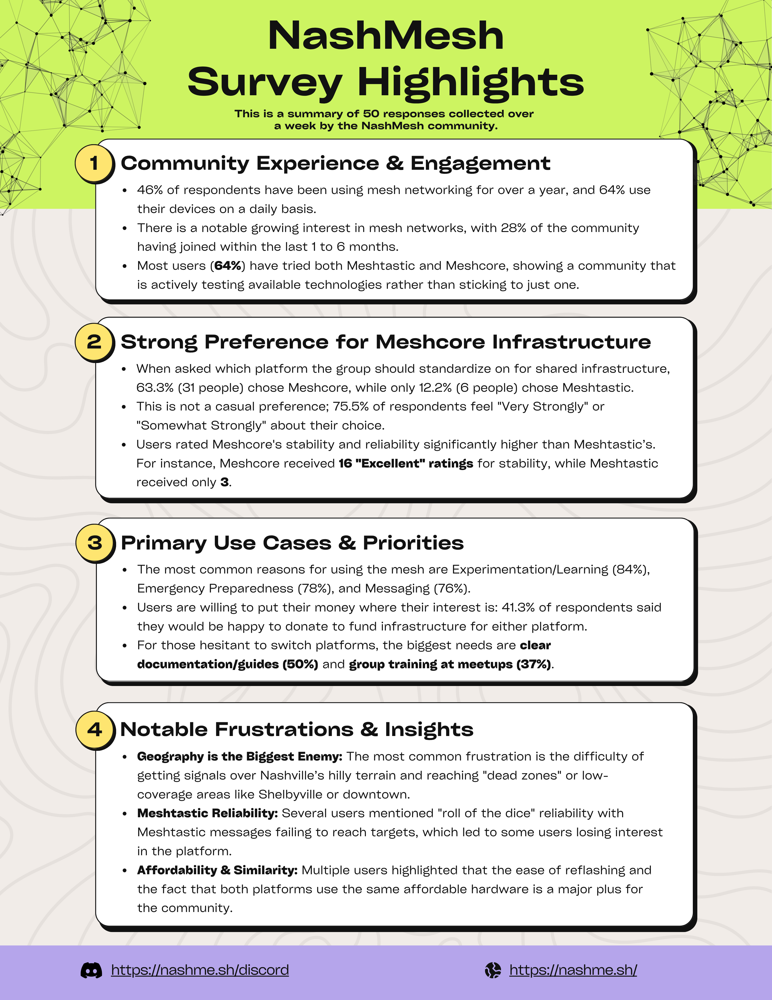

# 2026 NashMesh Community Survey Results

*By Stuart Wilson*

**We recently ran a community survey and received 50 responses over the course of a week. Thank you to everyone who took the time to share their thoughts.**

A few things that stood out:

- **MeshCore is the clear community preference** for shared infrastructure — 63.3% chose it when asked which platform the group should standardize on, and 75.5% feel strongly about that choice.
- **Most users have tried both platforms** (64%), showing a community that's actively experimenting rather than just settling in.
- **Geography is our biggest technical challenge** — Nashville's hills and dead zones (including downtown and Shelbyville) came up repeatedly as the top frustration.
- **Documentation and training are the biggest asks** from members who are hesitant to switch platforms — something we're actively working on.

We'll be using this feedback to guide decisions on infrastructure, meetup topics, and resources. If you have questions or want to dig into the results further, come chat in the [NashMesh Discord](https://discord.gg/sSS8gEpuh8).
