# MeshCore Scaling Strategy: Region Scope & Channel Use for Middle TN

*Presented by jpryor223-kc8nno*
 
*<small>NashMesh Meetup, Wednesday, Aug 19, 2026</small>*

**As our mesh grows, unscoped flood traffic and airtime saturation become real problems. This talk from our latest meetup covers how MeshCore's region system solves that, and proposes a region scope for Middle TN / NashMesh.**

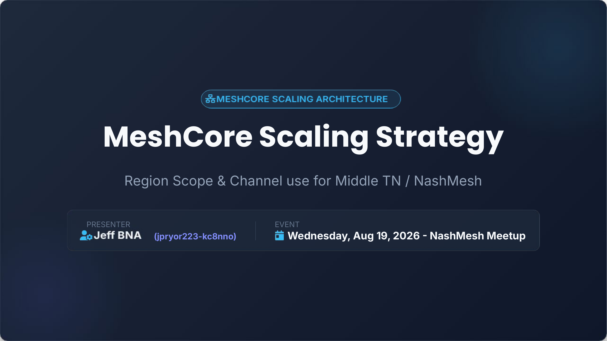{ .post-article-img }
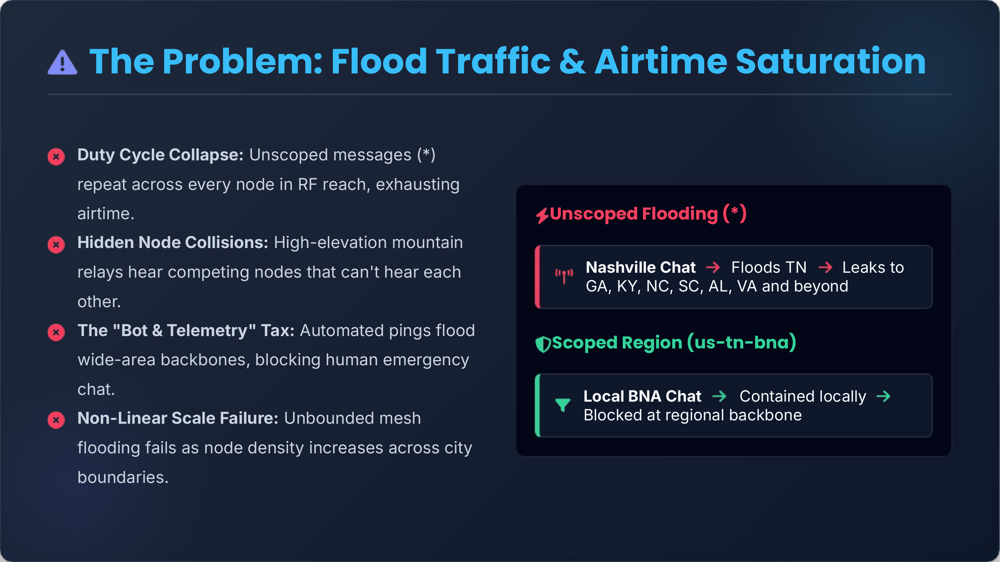{ .post-article-img }
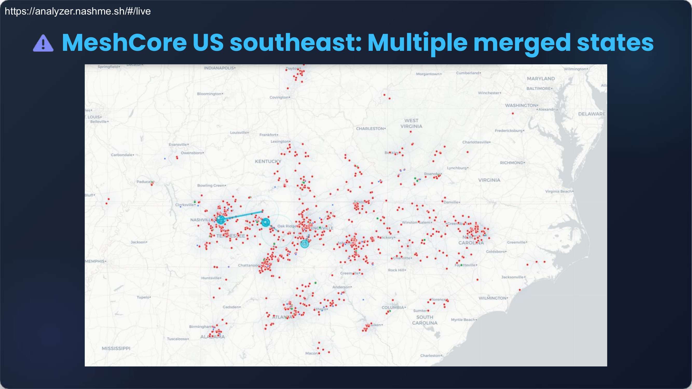{ .post-article-img }
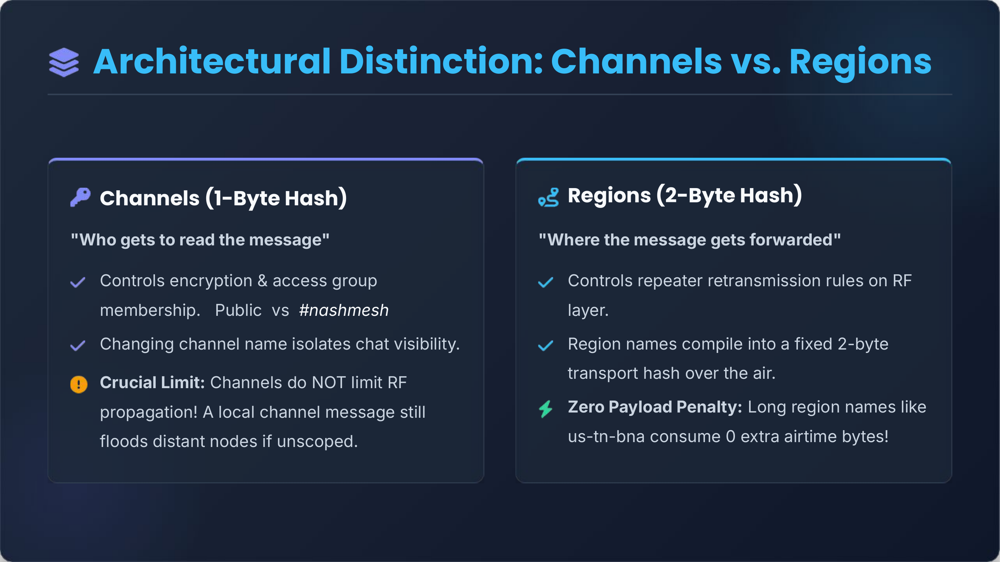{ .post-article-img }
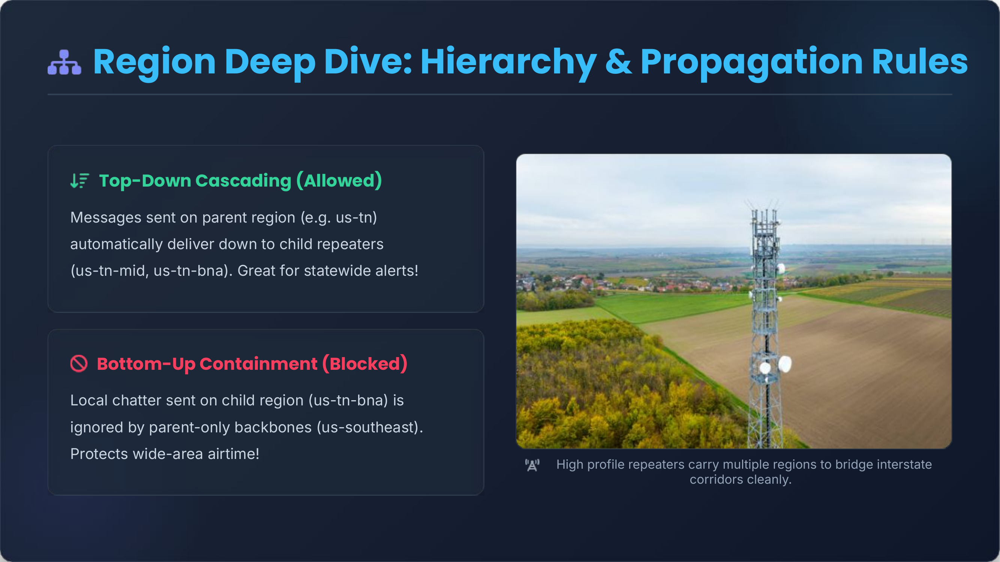{ .post-article-img }
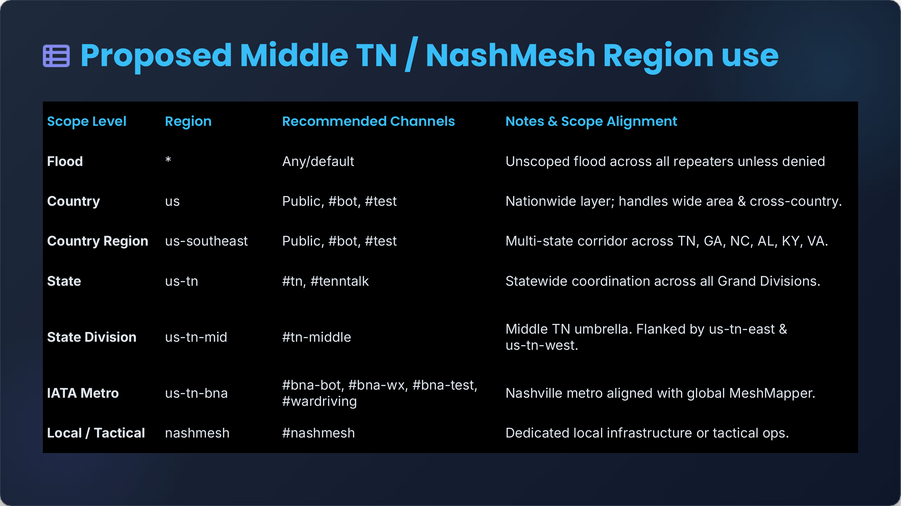{ .post-article-img }
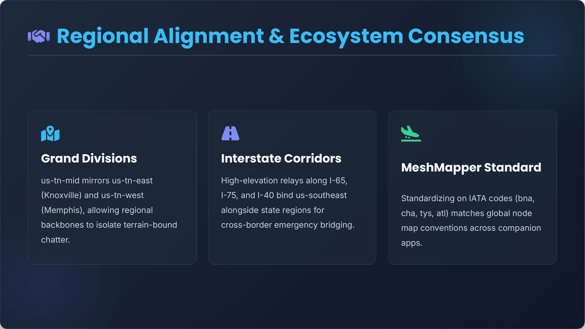{ .post-article-img }
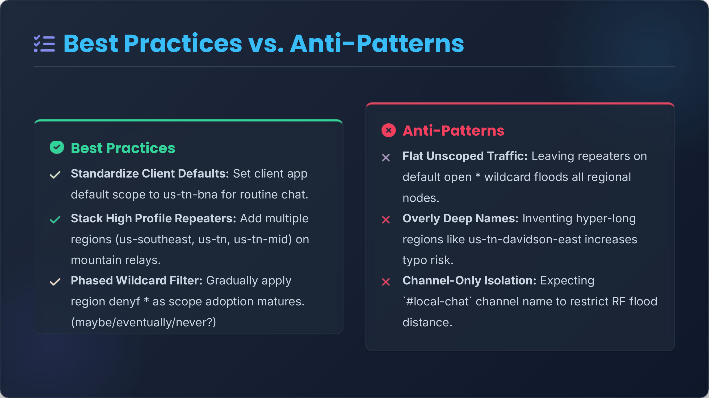{ .post-article-img }
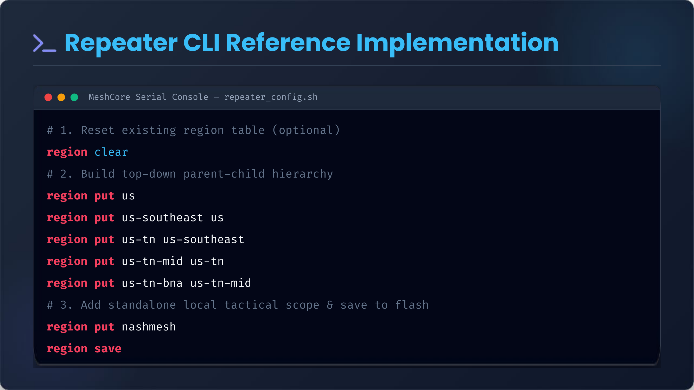{ .post-article-img }
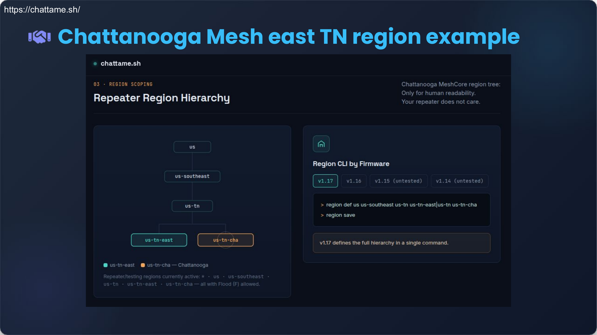{ .post-article-img }
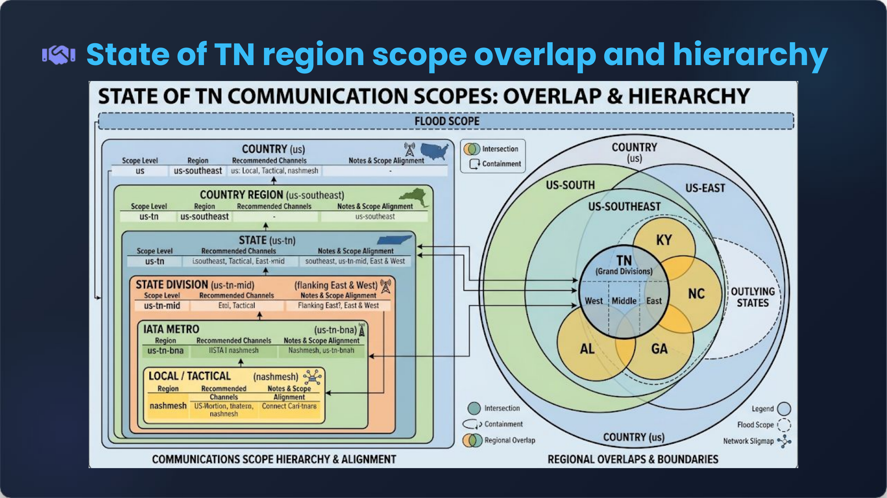{ .post-article-img }
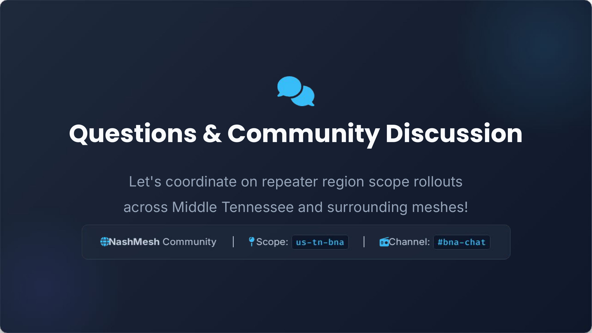{ .post-article-img }

Want the raw slide deck? [Download the PDF](../static/docs/meshcore_region_strategy.pdf).

Let's coordinate on repeater region scope rollouts across Middle Tennessee and surrounding meshes &mdash; come chat in the [NashMesh Discord](https://nashme.sh/discord).
