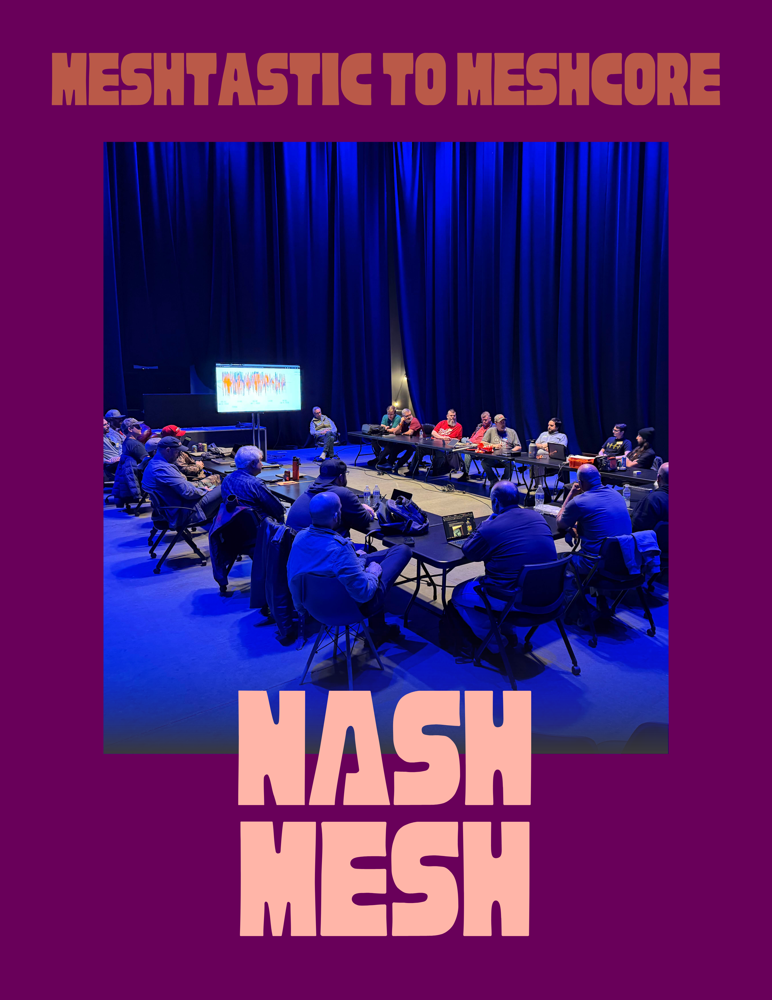
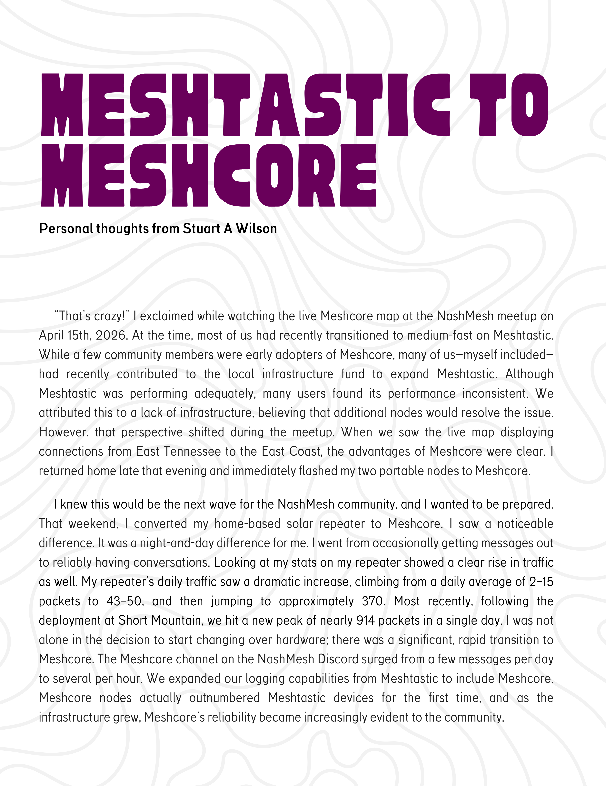
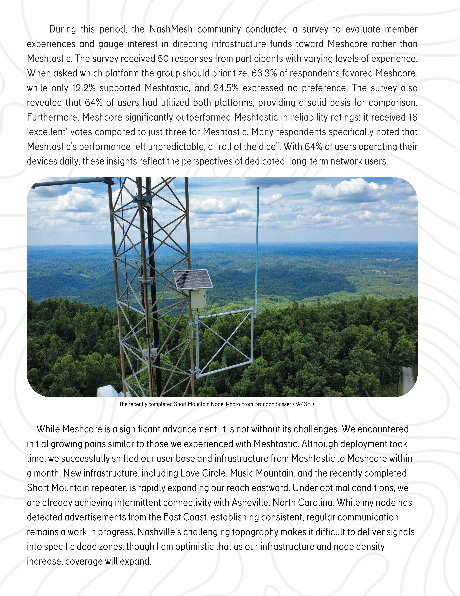

# Personal Thoughts: Meshtastic to MeshCore

*By Stuart W.*
 
*<small>Discord: @alaricvanvelsor</small>*

**The following is a personal opinion piece written by a member of the NashMesh community.**

{ .post-article-img }
{ .post-article-img }
{ .post-article-img }
{ .post-article-img }
